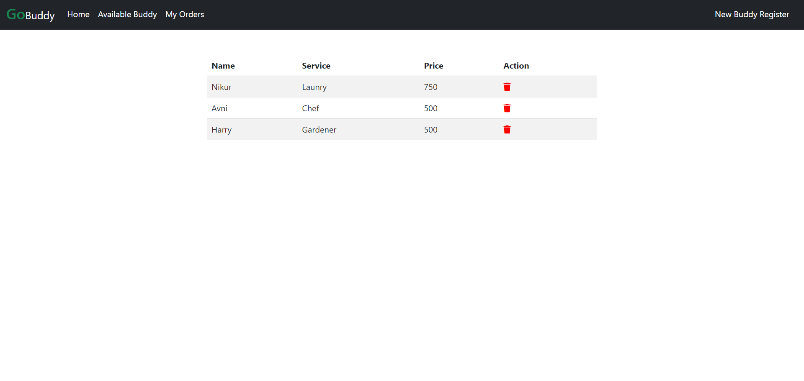

# Gobuddy 🚀




GoBuddy is a technology-enabled platform that connects customers with trusted service 
   		professionals for a variety of home services, including cleaning, plumbing, laundry, beauty, and 
   		more.It  aims to simplify urban living by providing reliable and high-quality services through its 
   		user-friendly website.GoBuddy operates in multiple cities across India and several international 
   		markets, ensuring customer satisfaction through rigorous professional training and quality checks. 

## Table of Contents

- [Features](#features)
- [Demo](#demo)
- [Diagram](#diagram)
- [Technologies Used](#technologies-used)
- [Installation](#installation)
- [Usage](#usage)
- [Contributing](#contributing)

## Features

- User authentication (registration).
- Browse and book various home services.
- View and manage bookings.
- Admin panel for managing services and professionals
- Responsive design for mobile and desktop use.

## Demo

You can try out the GoBuddy live [here](https://gobuddy-2.onrender.com/).

## Diagram

```

+-----------------+              +-----------------+
|      Book       | 1          * |   MyBookList    |
+-----------------+ <----------> +-----------------+
| - id: Integer   |              | - id: Integer   |
| - name: String  |              | - name: String  |
| - service: String|             | - service: String|
| - price: String |              | - price: String |
+-----------------+              +-----------------+


```

## Technologies Used

- JAVA17
- Spring Boot
- Spring Web
- Spring Data JPA
- Spring Security
- PostgreSQL
- Lombok
- Thymeleaf
- Maven

## Installation

To run this project locally, follow these steps:

1. Clone the repository:

    ```bash
    git clone https://github.com/omgupta7352/Gobuddy.git
    ```

2. Navigate to the project directory:

    ```bash
    cd Gobuddy
    ```


3. Build and run the application:

    ```bash
    mvn clean install
    ```

    ```bash
    mvn spring-boot:run
    ```
    

4. Open your web browser and go to `http://localhost:8080`.

## Usage

1. Open your browser and navigate to `http://localhost:8080`.
2. Register a new user account.
3. Browse available home services and book the desired service.
4. View and manage your bookings.


## Contributing

Contributions are welcome! If you would like to contribute to this project, please follow these steps:

1. Fork the repository.
2. Create a new branch for your feature or bugfix:

    ```bash
    git checkout -b feature/your-feature-name
    ```

3. Commit your changes:

    ```bash
    git commit -m 'Add some feature'
    ```

4. Push to the branch:

    ```bash
    git push origin feature/your-feature-name
    ```

5. Open a pull request on GitHub.
  
